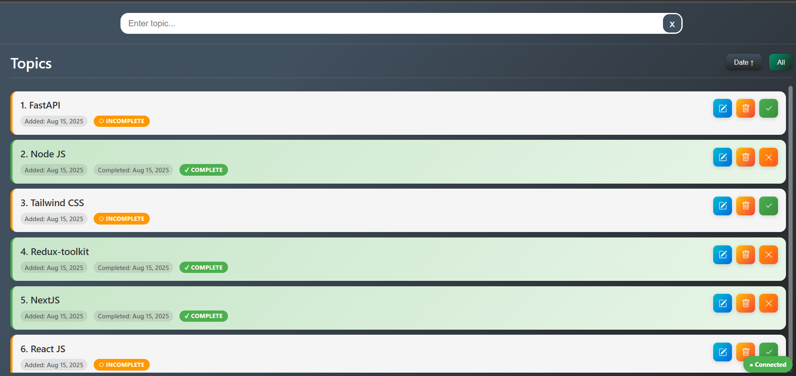
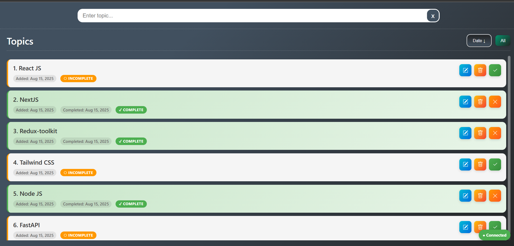
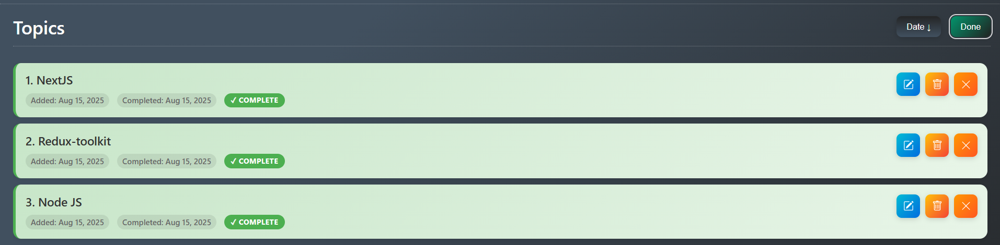
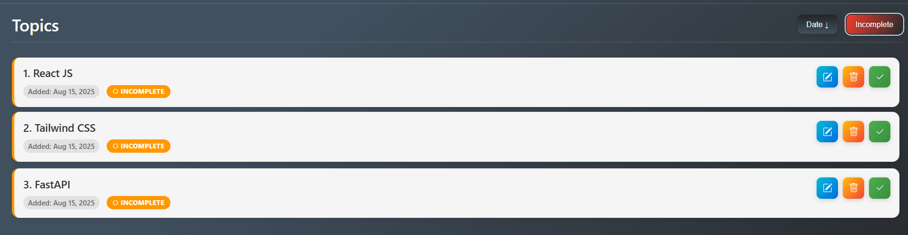

# 🚀 Topic Tracker – My First Socket.IO Learning Project

Welcome to **Topic Tracker**!  
This is my **first project** built using [Socket.IO](https://socket.io/), designed as a personal **learning tracker**. Track what you’re learning, see your progress in real time, and organize your study journey – all in one modern, responsive app!

## Screenshots
<table>
  <tr>
    <td></td>
    <td></td>
  </tr>
  <tr>
    <td></td>
    <td></td>
  </tr>
</table>

---

## ✨ Features

- **Real-time Updates:** Instantly syncs all changes across open tabs or multiple users using Socket.IO.
- **Topic CRUD:** Add, update, delete, and mark topics as complete/incomplete.
- **Priority & Metadata:** Set priorities for your learning goals.
- **Filters & Sort:** Toggle by completion status and sort by newest or oldest.
- **Inline Editing:** Edit any topic directly in the list.
- **Responsive UI:** Clean, easy-to-use layout.
- **Keyboard Shortcuts:**
  - `Ctrl+R` – Refresh topics
  - `/` – Focus the input box
- **Connection Status:** Visual indicator for online/offline server connectivity.
- **REST API:** All CRUD actions available over REST as well as real-time.

---

## 🧑‍💻 Why I Built This

> **“This is my first real project using Socket.IO and the concept of real-time apps!  
> I built Topic Tracker to organize my learning, experiment with sockets, and understand how to manage data live across devices.”**

---

## 🛠️ Getting Started

### Prerequisites

- **Node.js** v14+
- **npm** (or **yarn**)
- Any supported SQL database
- _(Optional but recommended)_ Git

### Installation

1. **Clone this repository:**

   - git clone https://github.com/ExploreWithMeet/topic-tracker.git  
   - cd topic-tracker

2. **Install all dependencies:**

   - npm install

3. **Database Configuration:**

   - Make an `.env` file, to store credentials.
   - Navigate to `config/database.js`
   - You can use `.env` file if you want to make it private or else for learning you can directly mention. no need to use `process.env.KEY`.

```
  development: {
    username: process.env.DB_USERNAME,
    password: process.env.DB_PASSWORD,
    database: process.env.DB_NAME,
    host: process.env.DB_HOST,
    port: process.env.DB_PORT,
    dialect: process.env.DIALECT,
    ...
  }
  ```

4. **(About Socket Library)**

   - I had installed socket.io package through node package manager.
   - But If you dont want to do that than call CDN library from 

5. **Fire Up the App:**

   - npm run dev

## 🌐 REST API Endpoints

| Method | Endpoint                 | Description                      |
| ------ | ------------------------ | -------------------------------- |
| GET    | `/api/topics`            | Retrieve all topics              |
| POST   | `/api/topics`            | Create a new topic               |
| PUT    | `/api/topics/:id`        | Update topic details             |
| PATCH  | `/api/topics/:id/status` | Toggle complete/incomplete       |
| DELETE | `/api/topics/:id`        | Remove a topic                   |
| GET    | `/api/topics/stats`      | Stats for your learning progress |

---

## 🧩 Project Structure
```
topic-tracker/
│
├── public/
│ ├── index.html 
│ ├── script.js 
│ └── style.css 
│
├── models/
│ ├── index.js 
│ └── Topic.js 
│
├── routes/
│ └── topics.js 
│
├── controllers/
│ └── topicController.js 
│
├── middleware/
│ └── validate.js 
│
├── config/
│ └── database.js 
│
├── server.js 
├── socket.js 
├── package.json
└── README.md
```
---

## 🔒 Security Notes

- All DB credentials are in `config/database.js` (**do NOT share this file publicly!**)
- For production, review your `helmet` CSP and use secure config.
- REST API is **not authenticated** by default – add security before going public.

---

## 📝 Future Improvements / TODO

- [ ] Mobile UI/UX polish
- [ ] Enhanced offline mode (local storage + sync)
- [ ] User authentication (login, signup)
- [ ] Due dates/reminders for topics
- [ ] Analytics dashboard
- [ ] Theme Change!

---

## 📧 Contact / Issues

If you run into trouble, want to submit ideas, or just want to say hi:

- Open an Issue [here](https://github.com/ExploreWithMeet/topic-tracker/issues)
- Or reach out: meetsanghvi2347@gmail.com

